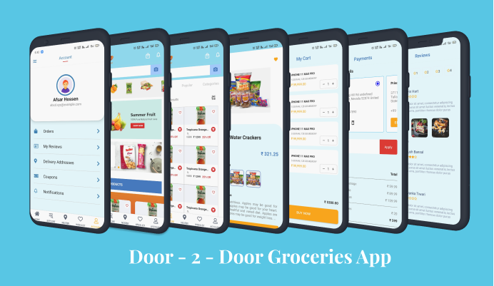

<!-- PROJECT LOGO -->
<div align="center">
  <h3 align="center">Door2Door Groceries</h3>

  <p align="center">
    Mobile App Interface for Door2Door Groceries Service
    <br />
    <a href="https://github.com/joshidipesh12/door2door-groceries#About The Project">View Demo</a>
    ·
    <a href="https://github.com/joshidipesh12/door2door-groceries/issues">Report Bug</a>
    ·
    <a href="https://github.com/joshidipesh12/door2door-groceries/issues">Request Feature</a>
  </p>
</div>

<!-- ABOUT THE PROJECT -->

## About The Project

<p align="center">
  
</p>

### Built With

The app is built for android only (as of now) with React-Native and some other popular JavaScript libraries.

Designed with Figma.

- [React-Native](https://reactnative.dev/)
- [Figma](https://www.figma.com/)

<!-- GETTING STARTED -->

## Getting Started

If you are interested in contributing and commercial use of the app UI, remember to contact the maintainer to avoid copyright infringement.

### Prerequisites

- npm ( or yarn )

  ```sh
  npm install npm@latest -g
  ```

- Android SDK & Android Studio

- react-native-cli

  ```sh
  npm install react-native-cli -g
  ```

`visit` https://reactnative.dev/docs/environment-setup

### Installation

1. Clone the repo
   ```sh
   git clone https://github.com/your_username_/Project-Name.git
   ```
2. Install NPM packages

   ```sh
   npm install
   ```

3. Run project as Dev
   ```sh
   react-native start && react-native run-android
   ```

<!-- USAGE EXAMPLES -->

## Usage

- Get release apk installed
  ```sh
  react-native run-android --variant=release
  ```

<!-- ROADMAP -->

## Roadmap

- [✔️] App Design
- [✔️] UI+UX with Neact-Native
- [❌] App BackEnd

See the [open issues](https://github.com/joshidipesh12/door2door-groceries/issues) for a full list of proposed features (and known issues).

<!-- CONTRIBUTING -->

## Contributing

Contributions are what make the open source community such an amazing place to learn, inspire, and create. Any contributions you make are **greatly appreciated**.

If you have a suggestion that would make this better, please fork the repo and create a pull request. You can also simply open an issue with the tag "enhancement".
Don't forget to give the project a star! Thanks again!

1. Fork the Project
2. Create your Feature Branch (`git checkout -b feature/AmazingFeature`)
3. Commit your Changes (`git commit -m 'Add some AmazingFeature'`)
4. Push to the Branch (`git push origin feature/AmazingFeature`)
5. Open a Pull Request

<!-- LICENSE -->

## License

Distributed under the MIT License. See `LICENSE.txt` for more information.

<!-- CONTACT -->

## Contact

Dipesh Joshi - [@joshidipesh12](https://github.com/joshidipesh12) - joshidipesh12@gmail.com

Project Link: [https://github.com/joshidipesh12/door2door-groceries](https://github.com/joshidipesh12/door2door-groceries)

<!-- ACKNOWLEDGMENTS -->

## Acknowledgments

- [Door2Door Website](https://dtodservice.com)
- [App Design](https://www.figma.com/file/HYkLdjeiOFRX5iew704bbh/Door-2-Door-Groceries?node-id=0%3A1)

[![Contributors][contributors-shield]][contributors-url]
[![Forks][forks-shield]][forks-url]
[![Stargazers][stars-shield]][stars-url]
[![Issues][issues-shield]][issues-url]
[![MIT License][license-shield]][license-url]
[![LinkedIn][linkedin-shield]][linkedin-url]

<!-- MARKDOWN LINKS & IMAGES -->
<!-- https://www.markdownguide.org/basic-syntax/#reference-style-links -->

[contributors-shield]: https://img.shields.io/github/contributors/joshidipesh12/door2door-groceries.svg?style=for-the-badge
[contributors-url]: https://github.com/joshidipesh12/door2door-groceries/graphs/contributors
[forks-shield]: https://img.shields.io/github/forks/joshidipesh12/door2door-groceries.svg?style=for-the-badge
[forks-url]: https://github.com/joshidipesh12/door2door-groceries/network/members
[stars-shield]: https://img.shields.io/github/stars/joshidipesh12/door2door-groceries.svg?style=for-the-badge
[stars-url]: https://github.com/joshidipesh12/door2door-groceries/stargazers
[issues-shield]: https://img.shields.io/github/issues/joshidipesh12/door2door-groceries.svg?style=for-the-badge
[issues-url]: https://github.com/joshidipesh12/door2door-groceries/issues
[license-shield]: https://img.shields.io/github/license/joshidipesh12/door2door-groceries.svg?style=for-the-badge
[license-url]: https://github.com/joshidipesh12/door2door-groceries/blob/master/LICENSE.txt
[linkedin-shield]: https://img.shields.io/badge/-LinkedIn-black.svg?style=for-the-badge&logo=linkedin&colorB=555
[linkedin-url]: https://linkedin.com/in/joshidipesh12
